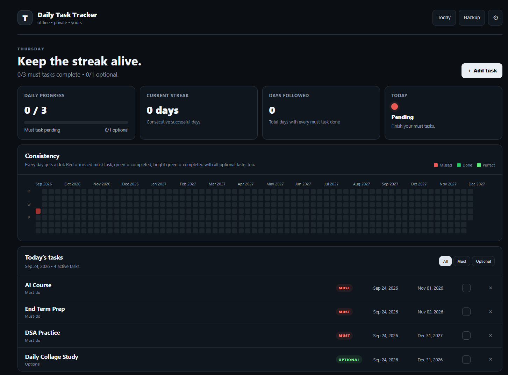
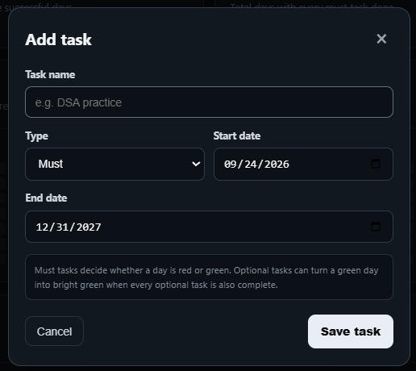

# Daily Task Tracker

An offline-first Windows daily task tracker designed to keep daily routines simple, visible, and consistent.

## Features

- Add unlimited daily tasks
- Create **Must-do** and **Optional** tasks
- Set a start date and end date for every task
- Automatically refresh the active task list for each day
- Track daily task completion
- **Red** day → one or more Must-do tasks were missed
- **Green** day → all Must-do tasks were completed
- **Bright Green / Perfect** day → all Must-do and Optional tasks were completed
- Track your **current streak**
- Track total **successful days**
- View long-term consistency using a contribution-style calendar
- Filter tasks by **All, Must, or Optional**
- Backup local task data
- Works offline and keeps task data locally

## Screenshots

### Dashboard



### Add Task



## Installation

### Windows — Recommended

If you just want to use Daily Task Tracker, download the latest Windows installer from the GitHub Releases page.

**[Download the latest release](../../releases/latest)**

1. Open the latest release.
2. Download the `.exe` installer.
3. Run the downloaded installer.
4. Follow the installation steps.
5. Launch **Daily Task Tracker** from the Start Menu or desktop shortcut.

> **You do not need Node.js, npm, Git, or any development tools to use the installed application.**

---

### Run from Source

If you want to run or modify the project from source, you need:

- Windows
- Node.js
- npm
- Git

#### 1. Clone the repository

```bash
git clone https://github.com/RajatBhardwaj2006/Daily-Task-Tracker.git
```

#### 2. Open the project folder

```bash
cd Daily-Task-Tracker
```

#### 3. Install the required dependencies

```bash
npm install
```

#### 4. Start the application

```bash
npm start
```

The **Daily Task Tracker** application should now open.

## Building the Windows Installer

To create a Windows `.exe` installer from the source code, run:

```bash
npm run dist
```

The generated installer will be created in the project's build/release output folder.

The generated `.exe` can then be installed on a Windows computer like a normal application.

## Task Types

### Must-do

Must-do tasks determine whether the day is successful.

If all Must-do tasks are completed:

**Day = Green**

If any Must-do task is missed:

**Day = Red**

### Optional

Optional tasks are not required for a successful day.

If all Must-do tasks **and** all Optional tasks are completed:

**Day = Bright Green / Perfect**

## Date-Based Tasks

Every task can have its own active date range.

Each task contains:

- Task name
- Task type
- Start date
- End date

A task is displayed as an active task only during its configured date range.

Example:

```text
DSA Practice
Start: Sep 24, 2026
End: Dec 31, 2027
```

## Daily Progress

Daily Task Tracker keeps track of your progress throughout each day.

The tracker shows:

- Must-do task completion
- Optional task completion
- Daily completion status
- Current streak
- Total successful days
- Today's progress

## Consistency Tracking

The contribution-style calendar provides a long-term view of your consistency.

Daily status is represented as:

- **Red** → One or more Must-do tasks were missed
- **Green** → All Must-do tasks were completed
- **Bright Green / Perfect** → All Must-do and Optional tasks were completed

This makes it easy to see your consistency over a longer period.

## Backup

The application includes a backup option for your local task data.

Use the backup functionality to keep a copy of your task information and restore it when needed.

## Offline & Privacy

Daily Task Tracker is designed to work offline.

Your task data is stored locally on your computer and the application does not require an internet connection for normal use.

Do not commit personal task data, local databases, credentials, or other private information to the GitHub repository.

## Development

After installing the dependencies, start the application with:

```bash
npm start
```

To create the Windows installer:

```bash
npm run dist
```

## Project Structure

```text
Daily-Task-Tracker/
│
├── doc/
│   ├── Main_page.png
│   └── Add_task.png
│
├── src/
│   └── ...
│
├── package.json
├── package-lock.json
├── README.md
└── .gitignore
```

## License

This project is provided for personal and educational use.
